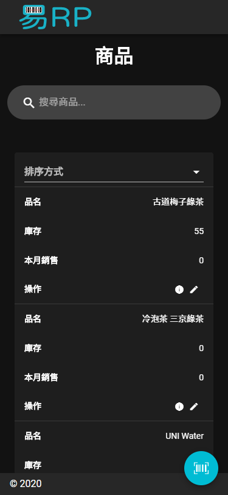
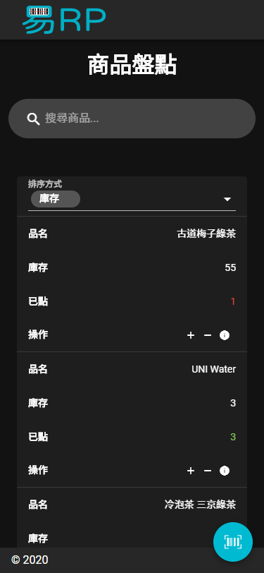
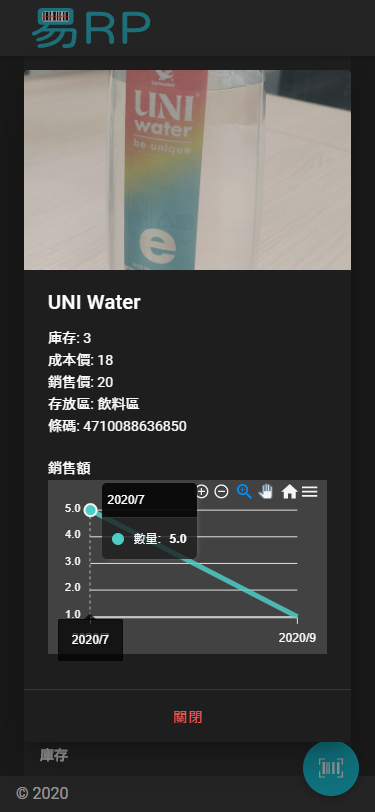
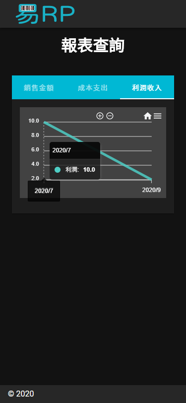

# 易RP

<p align="center">
  
</p>

一款以 LINE 生態系量身打造的企業資源管理系統  
**注意: 本專案為 prototype demo**






## 環境需求
- [Node.js](https://nodejs.org/en/) 14.0.0 以上
- [Yarn](https://yarnpkg.com/)
- [MongoDB](https://www.mongodb.com/)
- LINE Login Channel
- LINE Messaging API Channel

## 安裝
- 下載專案
- 執行 `yarn` 安裝相依套件
- 在根目錄建立 `.upload` 資料夾
- 設定 `.env` 檔
  ```shell
  # LINE MESSAGING API CHANNEL ID
  CHANNEL_ID=123456789
  # LINE MESSAGING API CHANNEL SECRET
  CHANNEL_SECRET=123456789abcde
  # LINE MESSAGING API ACCESS TOKEN
  CHANNEL_ACCESS_TOKEN=123456789abcde
  # LINE LOGIN LIFF ID
  CHANNEL_LIFF=123456789-abcde
  # MONGODB URL
  URL_DB=mongodb://127.0.0.1:27017/erp
  # SERVICE URL
  URL_SERVICE=https://erp.com
  # UPLOAD ASSETS TO FTP OR NOT
  FTP=false
  # FTP HOST
  FTP_HOST=ftp.com
  # FTP USERNAME
  FTP_USER=ftp_user
  # FTP PASSWORD
  FTP_PASS=ftp_pass
  # FTP UPLOAD DIRECTORY
  FTP_DIR=/public_html/erp/
  # ASSETS URL IF YOU USE FTP
  URL_ASSETS=https://ftp.com/erp
  # USE HTTPS CREDENTIALS IN ROOT DIRECTORY OR NOT
  HTTPS=false
  ```
- 設定 LINE Login Channel 和 LINE Messaging API Channel 的服務網址
- 在 MongoDB 建立名為 `user` 的 Collection，建立一筆管理員資料
  ```json
  {
    // 使用者名稱，登入系統時會更新為 LINE 使用者名稱
    "name":"老闆",
    // 使用者大頭貼，登入系統會更新為 LINE 使用者大頭貼
    "avatar":"",
    // 使用者權限，0 為管理員
    "role":0,
    // LINE ID
    "line":"U123456789"
  }
  ```

## 執行
- 使用 `yarn dev` 開啟開發伺服器
- 使用 `yarn start` 開啟一般伺服器
